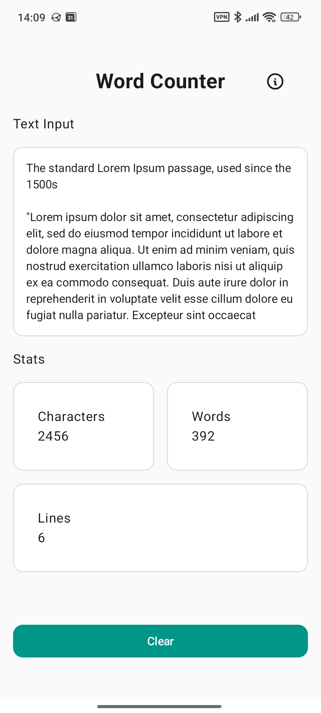
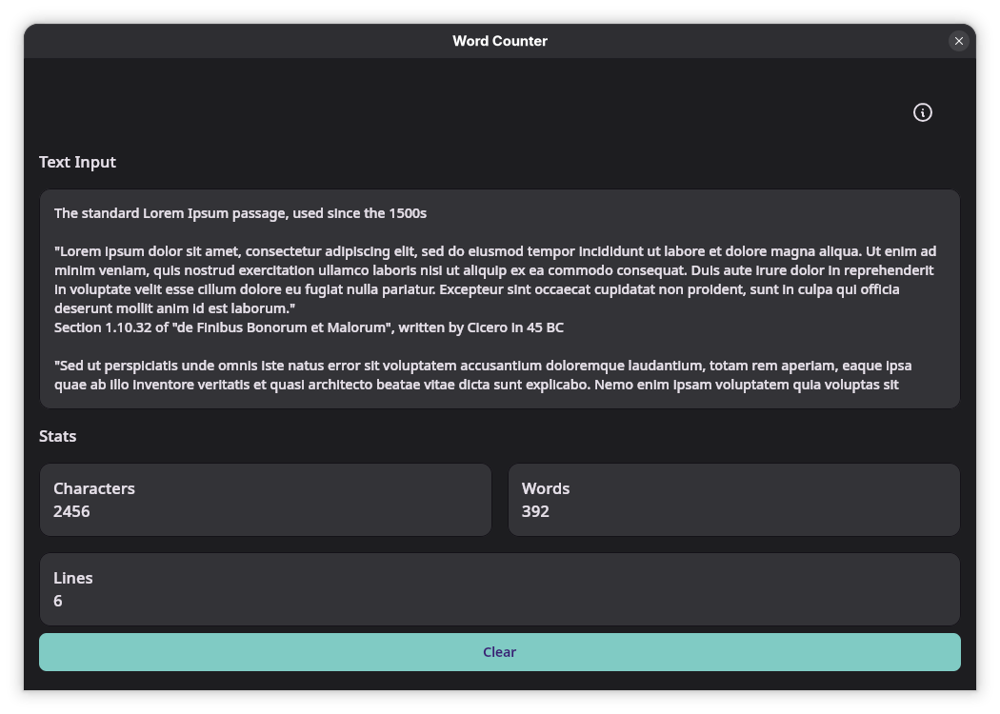

# Word Counter

A clean, modern, and private word counting app built with **Compose Multiplatform**.

  
  

## Tech stack

- **Language**: Kotlin.
- **UI Framework**: Compose Multiplatform.
- **Architecture**: MVVM.

## License

This project is licensed under the GPLv3 license. See the [License](LICENSE) file for more information.

## Credits

Made with ♥️ by [Deimos Hall](https://deimoshall.dev/about/).
